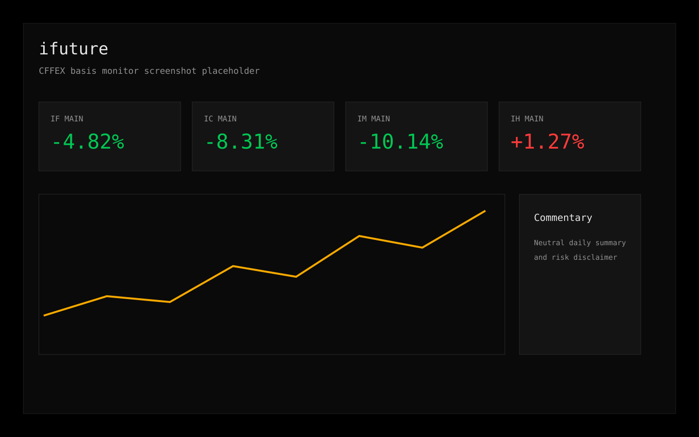
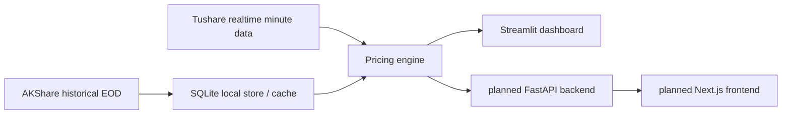

# ifuture · Index Futures Monitor

[中文说明](README.md)

`ifuture` is a self-hosted monitor for CFFEX equity index futures, focused on basis, annualized discount, cross-contract comparison, and practical day-to-day monitoring for Chinese retail traders.

Supported products:

- `IH` - SSE 50
- `IF` - CSI 300
- `IC` - CSI 500
- `IM` - CSI 1000



## What It Does

- Shows realtime basis `F - S`
- Normalizes contracts into annualized basis / discount
- Compares multiple contracts across `IH / IF / IC / IM`
- Renders a Streamlit dashboard for self-hosted usage
- Uses the user's own Tushare token for realtime minute data
- Falls back to a synthetic demo mode when no token is present

## Quick Start

### Local Python

```bash
git clone https://github.com/gamsing/ifuture.git
cd ifuture
python3 -m pip install -e .
python3 -m streamlit run monitor_ui.py
```

Open <http://localhost:8501>.

### Docker Compose

```bash
git clone https://github.com/gamsing/ifuture.git
cd ifuture
cp .env.example .env
docker compose up
```

Open <http://localhost:8501>.

`docker-compose.yml` now tolerates a missing `.env`, so the app can still boot into demo mode without a token.

## Token Model

Realtime data uses the user's own Tushare Pro token:

<https://tushare.pro/register>

Notes:

- Realtime endpoints such as `rt_idx_min` and `rt_fut_min` generally require `5000+` points
- The repository does not ship with any real token
- `.env`, caches, SQLite files, logs, and raw Tushare data must stay local

See [.env.example](/Users/gamsing/Downloads/untitled%20folder/.env.example) for placeholders.

## Demo Mode

If no `TUSHARE_RT_TOKEN`, `TUSHARE_TOKEN`, or `TS_TOKEN` is detected, the dashboard switches to a synthetic quote mode. This allows:

- UI preview without burning token quota
- screenshot generation for the repository
- basic local smoke testing

## Architecture



## Roadmap

- Publish-readiness and security hygiene
- package migration to `src/ifuture`
- AKShare historical provider
- snapshot bootstrap for first-run UX
- FastAPI + Next.js frontend
- dividend calendar, hedge calculator, daily commentary

## Disclaimer

This is an analytics tool, not investment advice. Users in mainland China should read the relevant futures risk disclosures before using it for decision support.

