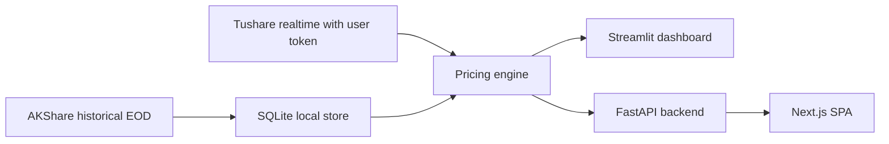

# ifuture · 股指期货监控器

[中文说明](README.zh-CN.md)

Realtime CFFEX index-futures basis and annualized discount monitor for Chinese retail traders.

中金所股指期货基差与年化贴水实时监控, 服务国内散户的多头入场决策。


## 30-Second Quick Start

```bash
git clone https://github.com/gamsing/ifuture.git
cd ifuture
cp .env.example .env
docker compose up
```

Open <http://localhost:8501>.

## Features

- Basis cards: realtime `F - S`, annualized basis, and product status.
- Percentile view: 1Y historical context for current annualized basis.
- Heatmap: cross-product contract comparison.
- Hedging calculator: estimate futures hedge cost for long equity portfolios.
- Daily commentary: neutral LLM-generated market summary with risk disclaimer.

## Tushare Token

Realtime minute endpoints use the user's own Tushare Pro token. Register at <https://tushare.pro/register>.

- Realtime `rt_idx_min` / `rt_fut_min` generally require 5000+ points.
- Demo mode is planned for token-free first startup using shipped snapshot data.
- Never commit `.env`, token files, local caches, SQLite databases, or raw Tushare data.

## Architecture



## Roadmap

- Publish-ready security hygiene and Docker startup.
- Package migration to `src/ifuture`.
- AKShare historical provider and snapshot bootstrap.
- FastAPI + Next.js mobile-first dashboard.
- Daily release snapshot workflow.

## Disclaimer

This is an analytics tool, not investment advice. 中国境内用户使用前请阅读期货风险揭示书。

## Star History

Star history chart will be added after the public repository starts receiving stars.
