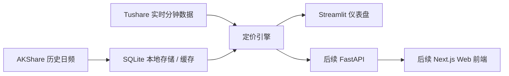

# ifuture · 股指期货监控器

[English](README.en.md)

中金所股指期货基差与年化贴水实时监控工具，面向国内散户和自托管用户，重点服务股指期货多头入场、贴水观察、跨合约比较与日常盯盘。

核心定位：

- 看实时基差：直接展示 `F - S`
- 看年化贴水：把不同合约剩余天数折算到同一口径
- 看历史位置：当前贴水大概处于过去 1 年的什么分位
- 看结构变化：IH / IF / IC / IM 之间谁更便宜、谁更贵


## 项目介绍

`ifuture` 主要覆盖中金所四大股指期货品种：

- `IH`：上证 50
- `IF`：沪深 300
- `IC`：中证 500
- `IM`：中证 1000

项目目前以 Streamlit 仪表盘为主，后续会扩展 FastAPI + Next.js 的移动优先前端。整个项目的设计目标不是做 SaaS，而是做一个可以自己部署、自己掌控 token、自己决定是否更新数据的本地化工具。

## 为什么做这个工具

对很多国内用户来说，股指期货最常见的观察语言不是复杂定价模型，而是：

- 现在贴水多少点
- 折成年化以后大概多少
- 和历史比算不算便宜
- 临近交割以后这个贴水有没有性价比

`ifuture` 的目标就是把这些信息放到一个能长期盯、能横向比、能自己部署的界面里，而不是让用户在 Excel、券商软件和零散脚本之间来回切换。

## 当前能力

- 实时监控 `IH / IF / IC / IM` 多合约快照
- 计算基差、年化基差、理论价格偏离
- 展示合约横向热力图
- 支持本地缓存与本地 SQLite 存储
- 支持使用 Tushare token 拉取实时分钟数据
- 无 token 时可进入演示模式，用合成行情渲染界面

当前仓库里已经可以直接启动 Streamlit 版本。更完整的“快照数据包 + 无 token 首次体验 + API + Web 前端”仍在路线图中。

## 30 秒快速开始

### 方式一：本地 Python 运行

```bash
git clone https://github.com/gamsing/ifuture.git
cd ifuture
python3 -m pip install -e .
python3 -m streamlit run monitor_ui.py
```

浏览器打开：<http://localhost:8501>

### 方式二：Docker Compose

```bash
git clone https://github.com/gamsing/ifuture.git
cd ifuture
cp .env.example .env
docker compose up
```

浏览器打开：<http://localhost:8501>

说明：

- `docker-compose.yml` 已允许缺省 `.env` 启动
- 没有 token 时，界面会进入演示模式
- 如果要看真实实时行情，再在 `.env` 里填入自己的 `TUSHARE_TOKEN`

## Tushare Token 说明

实时分钟数据依赖用户自己的 Tushare Pro token，注册链接：

<https://tushare.pro/register>

请注意：

- `rt_idx_min` / `rt_fut_min` 等实时接口通常要求 `5000+` 积分
- 本仓库不会内置任何真实 token
- 不应提交 `.env`、token 文件、本地缓存、SQLite 数据库或 Tushare 原始数据
- GitHub 公共仓库只适合放代码、派生指标、占位截图和后续可公开的数据快照方案

环境变量示例见 [.env.example](/Users/gamsing/Downloads/untitled%20folder/.env.example)。

## 演示模式

为了保证首次打开不被 token 卡住，当前仓库已经支持一个轻量演示模式：

- 当没有检测到 `TUSHARE_RT_TOKEN`、`TUSHARE_TOKEN` 或 `TS_TOKEN` 时
- 仪表盘会自动切换到合成行情
- 可以完整预览页面布局、指标列、热力图和交互流程

这适合：

- GitHub 访客先看界面
- README 截图制作
- 本地安装排错
- 不想消耗实时 token 配额时的 UI 检查

## 主要界面

当前 Streamlit 仪表盘包含这些核心区域：

- 左侧参数栏：品种、阈值、刷新频率、实时 adapter、数据库路径
- 顶部状态区：数据源、实时健康状态、刷新时间、实时行数、异常提示
- 主表格：合约、现货、期货、基差、理论价、偏离度、利率、股息率、剩余天数
- 热力图：多品种多合约的偏离对比
- 盘中图：单合约日内偏离轨迹

后续还会补：

- 分位数视图
- 分红日历
- 套保成本计算器
- 每日 AI 解读

## 数据来源与架构

项目采用双数据源思路：

- 历史日频：`AKShare`
- 实时分钟：`Tushare`



当前代码仍保留早期 `index_pricing/` 结构，后续计划迁移到 `src/ifuture/`。

## 目录结构

```text
.
├── index_pricing/              # 定价核心模块
├── monitor_ui.py               # Streamlit 主界面
├── realtime_adapter.py         # 实时数据适配层
├── price_indices.py            # 旧版脚本入口（后续会删除）
├── launch_index_monitor.command
├── scripts/check_secrets.py    # 本地 secret 扫描
├── README.md
├── README.en.md
└── docker-compose.yml
```

## 开发与安全约束

仓库已经做了这些基础安全处理：

- `.gitignore` 已忽略 `.env`、缓存、SQLite、日志、报告文件等本地数据
- `.env.example` 只保留占位符
- `.pre-commit-config.yaml` 配置了 `detect-secrets`、`gitleaks` 和自定义扫描脚本
- UI 已移除 token 前缀展示，只显示 `token=yes/no`
- 演示过程中产生的本地缓存和数据库不会纳入 Git

如果你要二次开发，推荐先运行：

```bash
python3 scripts/check_secrets.py
detect-secrets scan --all-files
```

## 路线图

### Phase A

- 完成公开仓库前的安全清理
- 补齐 Docker 与基础 README

### Phase B

- 将 `index_pricing/` 迁移到 `src/ifuture/`
- 修复节假日交割日处理
- 改善重试与缓存策略
- 增加测试覆盖率

### Phase C

- 接入 AKShare 历史数据提供器
- 构建历史快照与增量更新脚本
- 增加指标模块和解读模块

### Phase D / E

- 重构 Streamlit 页面
- 增加分红日历、套保计算器、每日评论
- 推出 FastAPI + Next.js 前端

## 适用人群

这个项目更适合以下用户：

- 会自己部署 Python / Docker 的个人投资者
- 习惯用 Tushare、AKShare、Pandas 做研究的量化爱好者
- 想长期跟踪股指贴水而不是只看单日行情的人

如果你只是偶尔看一下点位，这个项目可能比你需要的更重；但如果你每天都在盯股指期货相对价值，它会比零散脚本顺手得多。

## 免责声明

本项目是行情分析工具，不构成任何投资建议、交易建议或收益承诺。中国境内用户使用前请自行阅读并理解期货风险揭示书，并确认自己的交易权限、风控能力与合规责任。

## English

English readers can start from [README.en.md](README.en.md).

