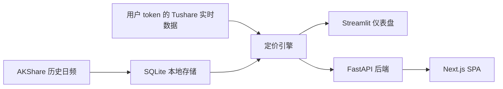

# ifuture · 股指期货监控器

[English](README.md)

中金所股指期货基差与年化贴水实时监控, 服务国内散户的多头入场决策。

English: Realtime CFFEX index-futures basis and annualized discount monitor for Chinese retail traders.


## 30 秒快速开始

```bash
git clone https://github.com/gamsing/ifuture.git
cd ifuture
cp .env.example .env
docker compose up
```

打开 <http://localhost:8501>。

## 功能

- 基差卡片: 实时 `F - S`、年化基差和产品状态。
- 分位数: 当前年化基差的 1 年历史位置。
- 热力图: 多品种、多合约横向比较。
- 套保成本计算器: 估算股票多头组合的股指期货套保成本。
- 每日解读: 中性、事实型的 LLM 盘面总结和风险提示。

## Tushare Token

实时分钟数据使用用户自己的 Tushare Pro token。注册链接: <https://tushare.pro/register>。

- 实时 `rt_idx_min` / `rt_fut_min` 通常需要 5000+ 积分。
- 演示模式计划支持无 token 首次启动, 使用随包快照数据。
- 不要提交 `.env`、token 文件、本地缓存、SQLite 数据库或 Tushare 原始数据。

## 架构



## 路线图

- 发布前安全清理和 Docker 一键启动。
- 迁移包名到 `src/ifuture`。
- AKShare 历史数据提供器和快照启动。
- FastAPI + Next.js 移动优先仪表盘。
- 每日快照发布工作流。

## 免责声明

本项目是行情分析工具, 不构成投资建议。中国境内用户使用前请阅读期货风险揭示书。
